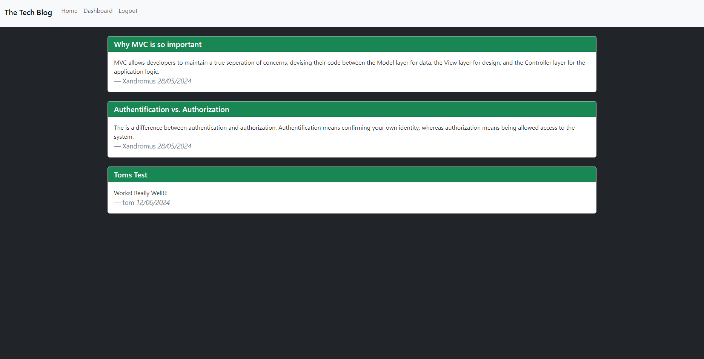
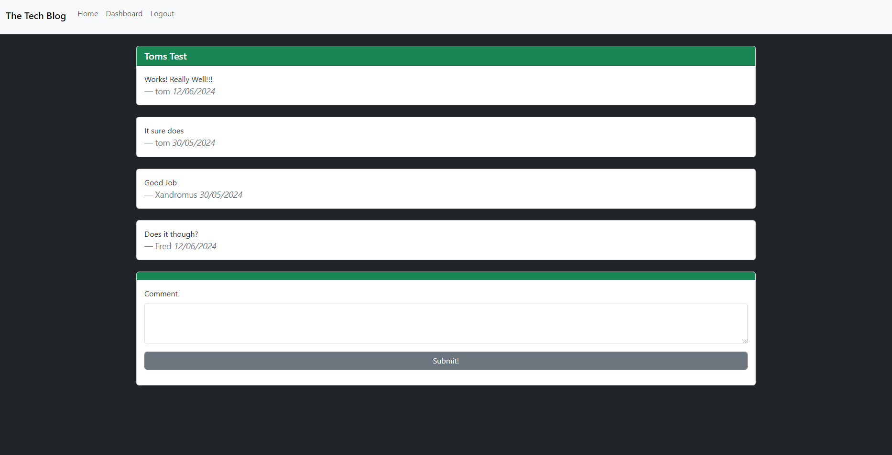
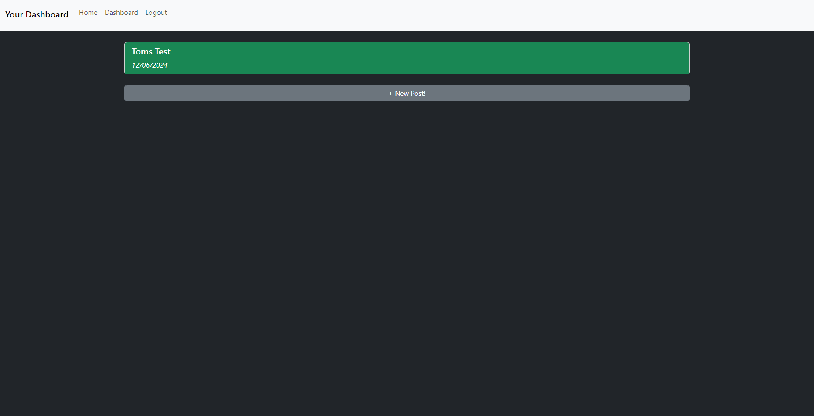

# Tech Blog

## The Project

This project was designed for a user to be able to publish their blog posts and comment on posts by others. They can also adjust existing posts by updating contents or deleting them all together. Other features include:

-   Login and Signup features for the user.
-   Accessing values on a database.
-   Dashboard page which contains posts specific to the active user.

## Link & Contents

-   [The Deployed Page](https://tech-blog-axsl.onrender.com)
-   [Installation and Usage](#installation-and-usage)
-   [Future Development](#future-development)
-   [Credits](#credits)
-   [Contributing](#contributing)
-   [Questions and Feedback](#questions-and-feedback)
-   [License](#license)

## Image

## Installation and Usage

This site is live on the web so no installation is necessary.

Just click the following [link](https://tech-blog-axsl.onrender.com), login of signup and start posting!

## Future Development

Ideas for future development include:

-   Adding account management options such as changing username, email and password.
-   Making editing and deleting of comment functionality.
-   Further customisable gui elements such as themes, profile pictures etc.

## Credits

Project set by edX/Monash University.

Made use of the Xpert learning assistant, AskBcs and our instructor with troubleshooting issues.

GitHub for hosting the repository.

Render for hosting the page.

The following authors for providing their codes for public use through npm:

-   Connect-Session-Sequelize
-   Dotenv
-   Express
-   Express-Handlebars
-   Express-Session
-   Nodemon
-   Pg
-   Sequelize

## Questions and Feedback

If you find any issues or have contributions or feedback you can do so by opening an [issue](https://github.com/Jiske-N/tech-blog/issues) on Github.

## Contributing

Should you wish to contribute you can do so by:

-   Clone the repository to your local machine.
-   Update the .env.EXAMPLE file with your postgres login and remove .EXAMPLE from the file name.
-   Open gitbash or similar in the root folder.
-   Run "npm install".

## License

None
